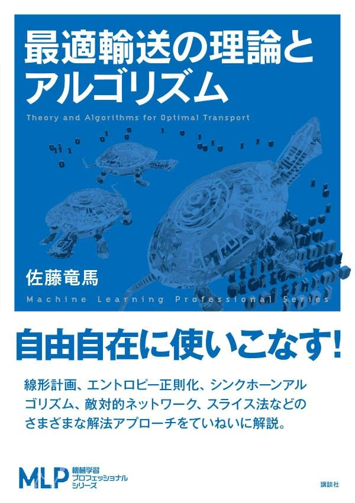

  

書籍『[最適輸送の理論とアルゴリズム](https://www.amazon.co.jp/dp/4065305144)』のサポートページです。

# ノートブック

以下のノートブックは MIT ライセンスのもと配布されております。商法・非商用問わず自由に利用することができます。

ノートブックを実行するには、[PyTorch](https://pytorch.org/) をインストールした後、`pip install -r requirements.txt` により依存関係をインストールしてください。Colab で実行する場合は事前のインストール作業は必要ありません。

### 一覧

|図|アルゴリズム|ファイル|Colab|
|:----|:----|:----|:----:|
|図 2.1||[fig2.1.ipynb](https://github.com/joisino/otbook/blob/main/notebooks/fig2.1.ipynb)||
|図 2.6||[fig2.6.ipynb](https://github.com/joisino/otbook/blob/main/notebooks/fig2.6.ipynb)||
|図 2.7||[fig2.7.ipynb](https://github.com/joisino/otbook/blob/main/notebooks/fig2.7.ipynb)||
|図 2.9||[fig2.9.ipynb](https://github.com/joisino/otbook/blob/main/notebooks/fig2.9.ipynb)||
|図 2.14||[fig2.14.ipynb](https://github.com/joisino/otbook/blob/main/notebooks/fig2.14.ipynb)||
|図 2.15||[fig2.15.ipynb](https://github.com/joisino/otbook/blob/main/notebooks/fig2.15.ipynb)||
|図 3.1||[fig3.1.ipynb](https://github.com/joisino/otbook/blob/main/notebooks/fig3.1.ipynb)||
||アルゴリズム 3.2|[algo3.2.ipynb](https://github.com/joisino/otbook/blob/main/notebooks/algo3.2.ipynb)||
|図 3.4||[fig3.4.ipynb](https://github.com/joisino/otbook/blob/main/notebooks/fig3.4.ipynb)||
|図 3.5|アルゴリズム 3.6|[fig3.5.ipynb](https://github.com/joisino/otbook/blob/main/notebooks/fig3.5.ipynb)||
||アルゴリズム 3.7|[algo3.7.ipynb](https://github.com/joisino/otbook/blob/main/notebooks/algo3.7.ipynb)||
||アルゴリズム 4.2|[algo4.2.ipynb](https://github.com/joisino/otbook/blob/main/notebooks/algo4.2.ipynb)||
||アルゴリズム 4.4|[algo4.4.ipynb](https://github.com/joisino/otbook/blob/main/notebooks/algo4.4.ipynb)||
||アルゴリズム 5.2|[algo5.2.ipynb](https://github.com/joisino/otbook/blob/main/notebooks/algo5.2.ipynb)||
||アルゴリズム 7.1|[algo7.1.ipynb](https://github.com/joisino/otbook/blob/main/notebooks/algo7.1.ipynb)||
|図 8.1||[fig8.1.ipynb](https://github.com/joisino/otbook/blob/main/notebooks/fig8.1.ipynb)||
|図 8.2|アルゴリズム 8.3|[fig8.2.ipynb](https://github.com/joisino/otbook/blob/main/notebooks/fig8.2.ipynb)||
|図 8.3|アルゴリズム 8.3|[fig8.3.ipynb](https://github.com/joisino/otbook/blob/main/notebooks/fig8.3.ipynb)||
|図 8.4||[fig8.4.ipynb](https://github.com/joisino/otbook/blob/main/notebooks/fig8.4.ipynb)||
|図 9.4|アルゴリズム 9.1|[fig9.4.ipynb](https://github.com/joisino/otbook/blob/main/notebooks/fig9.4.ipynb)||

# 正誤表

本書の正誤情報は[正誤表](https://github.com/joisino/otbook/blob/main/eratta.md)にて公開しています。
